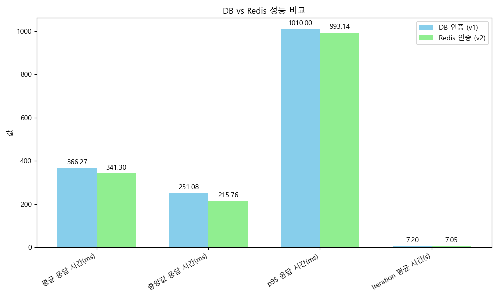
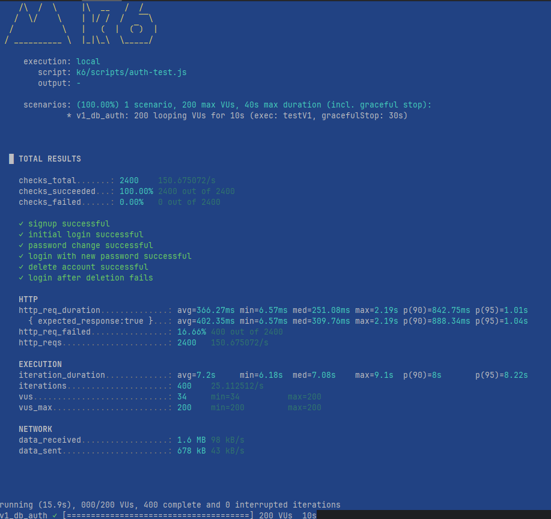
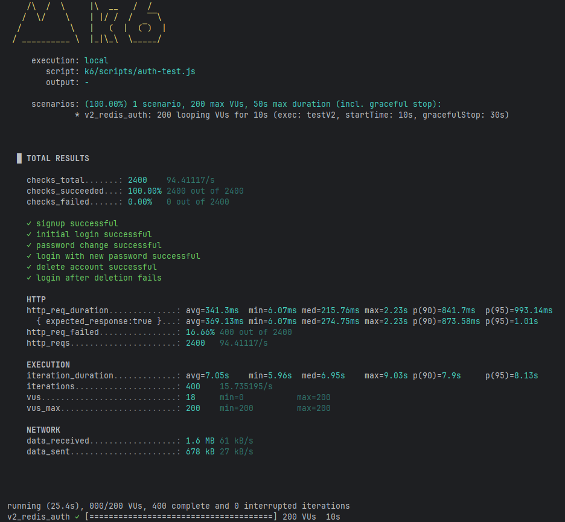

# 성능 향상 분석 보고서

## 개요
본 문서는 k6 부하 테스트를 통해 **DB 기반 인증(v1)**과  
**Redis 기반 인증(v2)**을 비교하여 성능 향상 효과를 분석한 결과를 담고 있다.

## 테스트 환경
- **DB 기반 인증 (v1)**
- **Redis 기반 인증 (v2)**
- 테스트 스크립트: 회원가입 → 로그인 → 토큰 갱신 → 로그아웃 시나리오
- VUs: 200, Duration: 10초

## 결과 요약

| 항목 | DB 인증 (v1) | Redis 인증 (v2) |
|------|--------------|-----------------|
| 총 요청 수 (http_reqs) | 2400 (150.67/s) | 2400 (94.41/s) |
| 성공률 (checks_succeeded) | 100% (2400/2400) | 100% (2400/2400) |
| 평균 응답 시간 (http_req_duration) | 366.27ms | **341.3ms** |
| 중앙값 응답 시간 (Median) | 251.08ms | **215.76ms** |
| 최대 응답 시간 (max) | 2.19s | 2.23s |
| 90% 응답 시간 (p90) | 842.75ms | **841.7ms** |
| 95% 응답 시간 (p95) | 1.01s | **993ms** |
| Iteration 평균 시간 | 7.2s | **7.05s** |
| 데이터 수신량 | 1.6 MB (98 kB/s) | 1.6 MB (61 kB/s) |
| 데이터 송신량 | 678 kB (43 kB/s) | 678 kB (27 kB/s) |

## 성능 향상 포인트
- **응답 속도 개선**: Redis 환경이 평균 응답 시간에서 약 7% 더 빠름 (366.27ms → 341.3ms)
- **처리 효율 증가**: Iteration 평균 시간이 더 짧아 사용자 경험 개선 (7.2s → 7.05s)
- **네트워크 효율성**: Redis가 데이터 전송량을 더 적게 사용하여 리소스 효율성 향상


## 결론
Redis 기반 인증(v2)은 **응답 속도, 처리 효율, 네트워크 효율성**에서 DB 기반 인증(v1)보다 우수한 성능을 보여준다.  
특히 평균/중앙값 응답 시간과 Iteration 효율성에서 차이가 뚜렷하며, 안정성은 동일하게 유지된다.  
따라서 서비스 확장성과 성능 최적화를 위해 Redis 기반 인증 환경이 더 적합하다고 결론지을 수 있다.

## 트레이드 오프
- Redis는 메모리 기반이라 속도는 빠르지만, 영속성은 DB에 의존해야 함.
- DB는 안정성과 무결성을 제공하지만, 부하가 커질수록 응답 지연이 발생할 수 있음.


---

# 리프레시 토큰 db 운영 결과 

```bash
Running k6 load tests...

         /\      Grafana   /‾‾/                                                                                                                                                                                                    
    /\  /  \     |\  __   /  /                                                                                                                                                                                                     
   /  \/    \    | |/ /  /   ‾‾\                                                                                                                                                                                                   
  /          \   |   (  |  (‾)  |                                                                                                                                                                                                  
 / __________ \  |_|\_\  \_____/ 

     execution: local
        script: k6/scripts/auth-test.js
        output: -

     scenarios: (100.00%) 1 scenario, 200 max VUs, 40s max duration (incl. graceful stop):
              * v1_db_auth: 200 looping VUs for 10s (exec: testV1, gracefulStop: 30s)


  █ TOTAL RESULTS 

    checks_total.......: 2400    150.675072/s
    checks_succeeded...: 100.00% 2400 out of 2400
    checks_failed......: 0.00%   0 out of 2400

    ✓ signup successful
    ✓ initial login successful
    ✓ password change successful
    ✓ login with new password successful
    ✓ delete account successful
    ✓ login after deletion fails

    HTTP
    http_req_duration..............: avg=366.27ms min=6.57ms med=251.08ms max=2.19s p(90)=842.75ms p(95)=1.01s
      { expected_response:true }...: avg=402.35ms min=6.57ms med=309.76ms max=2.19s p(90)=888.34ms p(95)=1.04s
    http_req_failed................: 16.66% 400 out of 2400
    http_reqs......................: 2400   150.675072/s

    EXECUTION
    iteration_duration.............: avg=7.2s     min=6.18s  med=7.08s    max=9.1s  p(90)=8s       p(95)=8.22s
    iterations.....................: 400    25.112512/s
    vus............................: 34     min=34          max=200
    vus_max........................: 200    min=200         max=200

    NETWORK
    data_received..................: 1.6 MB 98 kB/s
    data_sent......................: 678 kB 43 kB/s


running (15.9s), 000/200 VUs, 400 complete and 0 interrupted iterations
v1_db_auth ✓ [======================================] 200 VUs  10s
```

# 리프레시 토큰 redis 운영 결과 

```bash
    /\  /  \     |\  __   /  /                                                                                                                                                                                                     
   /  \/    \    | |/ /  /   ‾‾\                                                                                                                                                                                                   
  /          \   |   (  |  (‾)  |                                                                                                                                                                                                  
 / __________ \  |_|\_\  \_____/ 

     execution: local
        script: k6/scripts/auth-test.js
        output: -

     scenarios: (100.00%) 1 scenario, 200 max VUs, 50s max duration (incl. graceful stop):
              * v2_redis_auth: 200 looping VUs for 10s (exec: testV2, startTime: 10s, gracefulStop: 30s)


  █ TOTAL RESULTS 

    checks_total.......: 2400    94.41117/s
    checks_succeeded...: 100.00% 2400 out of 2400
    checks_failed......: 0.00%   0 out of 2400

    ✓ signup successful
    ✓ initial login successful
    ✓ password change successful
    ✓ login with new password successful
    ✓ delete account successful
    ✓ login after deletion fails

    HTTP
    http_req_duration..............: avg=341.3ms  min=6.07ms med=215.76ms max=2.23s p(90)=841.7ms  p(95)=993.14ms
      { expected_response:true }...: avg=369.13ms min=6.07ms med=274.75ms max=2.23s p(90)=873.58ms p(95)=1.01s   
    http_req_failed................: 16.66% 400 out of 2400
    http_reqs......................: 2400   94.41117/s

    EXECUTION
    iteration_duration.............: avg=7.05s    min=5.96s  med=6.95s    max=9.03s p(90)=7.9s     p(95)=8.13s   
    iterations.....................: 400    15.735195/s
    vus............................: 18     min=0           max=200
    vus_max........................: 200    min=200         max=200

    NETWORK
    data_received..................: 1.6 MB 61 kB/s
    data_sent......................: 678 kB 27 kB/s


running (25.4s), 000/200 VUs, 400 complete and 0 interrupted iterations
v2_redis_auth ✓ [======================================] 200 VUs  10s
```